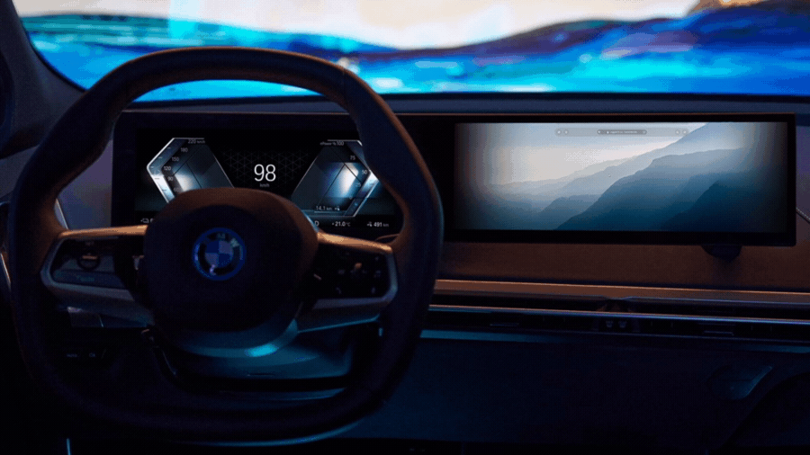

<p align="center">
    
</p>

# BMW CONNECT
## Disclaimer

The code for this project is classified and not publicly accessible. Therefore, the repository does not contain any code. Please reach out to the project lead for further inquiries.
## Project Overview
The BMW CONNECT project integrates a [mobile application](https://github.com/Sami-Souissi/BMW_CONNECT-APP-)
 and a [dashboard](https://github.com/Sami-Souissi/BMW_CONNECT-Dashboard-)
, both of which are interconnected to provide users with a comprehensive and intuitive experience in controlling a simulated BMW vehicle. The mobile app, developed using the React Native framework, facilitates seamless user authentication and access to the vehicle system. On the other hand, the dashboard, hosted on a Raspberry Pi 4, serves as the central control unit, enabling real-time monitoring and synchronization with the mobile app. The project emphasizes a futuristic, neon-inspired design, incorporating a customized BMW branding identity for both the app and the dashboard.

## Preview

<details>
  <summary>Click to expand for more images</summary>

  
  
  
  
   
     
      
       
        
    
</details>

## Table of Contents

- [Project Overview](#project-overview)
- [Features](#features)
- [Tech Stack](#tech-stack)
- [Usage](#usage)
- [Installation](#installation)
- [Credits](#credits)
- [License](#license)

---

# Project Overview

The dashboard is the central component of BMW CONNECT, offering a comprehensive interface for controlling various aspects of the simulated BMW vehicle. Users can access an array of features and functionalities seamlessly integrated into an intuitive and visually striking design. The dashboard acts as the nerve center, allowing users to interact with the simulated vehicle and monitor real-time changes, all while maintaining a futuristic and sleek aesthetic.

## Features

### User Interface

- Video splash screen
- Biometric-based login authentication
- Futuristic menu design with interactive elements
- Real-time synchronization with the server's display
- Glassmorphism UI design for a futuristic appeal

### User Actions

Once authenticated, users can perform the following actions:

- Control the vehicle's state (lock/unlock)
- Start/stop the engine
- Open/close doors and trunk
- Toggle lights on/off
- Access the full log of actions and server responses

### Admin Privileges

Admin users have additional privileges:

- Manage users and user groups (creation, editing, banning, deletion)
- Configure permissions and access time windows
- Access network control interface (WiFi and routing settings, data usage, connected devices, credentials management)
- Control the server (power on/off)
- Manage firewall settings (whitelisting, blacklisting, port forwarding, etc.)
## Tech Stack

### Dashboard


- Django
- Django REST framework
- Django Bootstrap4
- Django Cors Headers
- Beautiful Soup
- Pillow
- Social Auth Django
- Requests
- Typing Extensions

## Usage

### New User Registration

New users can connect to the server hosted on the Raspberry Pi via Wi-Fi. They can then scan the QR code displayed on the signup page of the web interface. This action redirects them to a download page for the mobile app. Upon installation, users can sign up using a username and password, linked to their device's biometrics through React Native biometrics.

## Installation

To run this project locally, follow these steps:

1. Clone this repository.
2. Install all the dependencies using `npm install`.
3. Run the development server using `npm start`.

```bash
$ git clone https://github.com/username/repo-name.git
$ cd repo-name
$ npm install
$ npm start
```


## Credits

This project was created for Primatek, utilizing a customized BMW branding identity for a visually appealing and functional interface design.
<p align="center">
    
</p>


## License

This project is licensed under the [MIT License](https://opensource.org/licenses/MIT). See the `LICENSE` file for more information.

